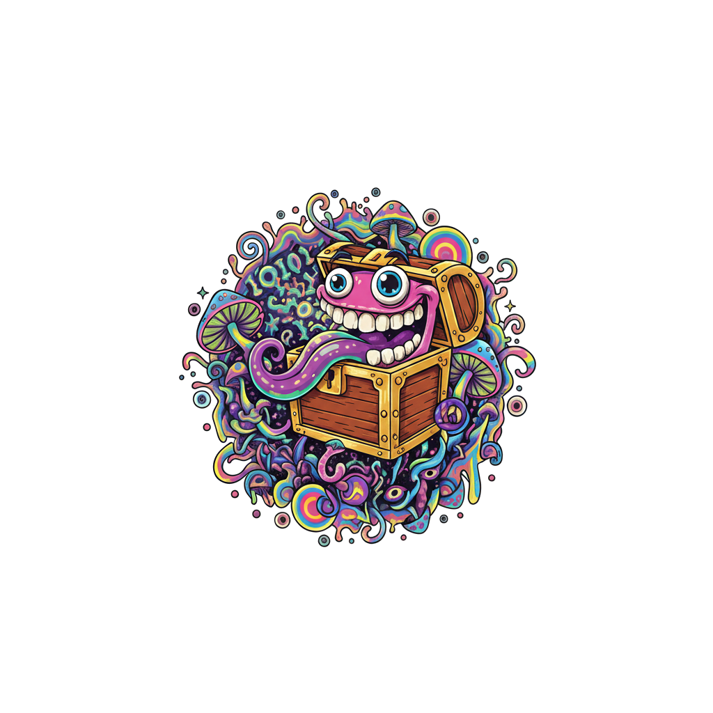

# mimic

<p align="center"></p>
<h2 align="center">Mimic</h2>

**mimic** is a Rust library that detects files which look normal but have been crafted to exploit parsing vulnerabilities in tools that process them. It is designed for **high throughput** (thousands of files per second) and provides a detailed comprehension of each file plus a maliciousness verdict.

### How it works

```
  ┌─────────────┐     ┌──────────────────┐     ┌─────────────────┐     ┌─────────────────────┐
  │  Raw bytes  │────▶│ detect_file_type  │────▶│ format-specific  │────▶│ AnalysisResult      │
  │  (file/buf) │     │ (magic / content) │     │ analyzer         │     │ verdict + threats   │
  └─────────────┘     └──────────────────┘     │ (DNG/RTF/TTF/   │     │ + comprehension     │
        │                       │               │  RAR/PDF)        │     └─────────────────────┘
        │                       ▼               └─────────────────┘
        │               ┌───────────────┐
        │               │ DNG │ RTF │ TTF │ RAR │ PDF │  (dispatch by FileType)
        │               └───────────────┘
        └───────────────────────────────────────────────────────────────────▶
                    CLI: SHA-256, --json, extraction_rtf / extraction_dng_tile
```

### Supported formats and threats (overview)

```
  Format    │ Threat / CVE              │ Detection (simplified)
  ──────────┼───────────────────────────┼────────────────────────────────────
  DNG/TIFF  │ CVE-2025-43300            │ SamplesPerPixel ≠ SOF3 components
            │ CVE-2025-21043            │ Excessive opcode count in OpcodeList
            │ DNG-TILE-CONFIG (low FP)  │ Invalid tile count / dimensions
  ──────────┼───────────────────────────┼────────────────────────────────────
  RTF       │ CVE-2025-21298            │ OLE Pres stream (UtOlePresStmToContentsStm UAF; zero-click)
            │ CVE-2026-21509            │ Malformed OLE in \object/\objdata
  ──────────┼───────────────────────────┼────────────────────────────────────
  TTF/OTF   │ CVE-2025-27363            │ FreeType GX/variable font subglyph (signed short wraparound)
            │ CVE-2023-41990            │ ADJUST opcodes (0x8F/0x90) in bytecode
  ──────────┼───────────────────────────┼────────────────────────────────────
  RAR       │ CVE-2025-8088             │ Path traversal via ADS (:.. \ …)
  ──────────┼───────────────────────────┼────────────────────────────────────
  PDF       │ (stub)                    │ Format detection only
```

## Supported formats and threats (detail)

### DNG (Digital Negative)

- **[CVE-2025-43300](https://www.cve.org/CVERecord?id=CVE-2025-43300)** — Apple RawCamera.bundle heap overflow  
  Detection: mismatch between **SamplesPerPixel** in TIFF/SubIFD metadata and **SOF3 component count** in the embedded JPEG Lossless stream. This inconsistency causes buffer overflows when decompressing. See [Detecting CVE-2025-43300](https://www.msuiche.com/posts/detecting-cve-2025-43300-a-deep-dive-into-apples-dng-processing-vulnerability/).

- **Related:** [Project Zero 442423708](https://project-zero.issues.chromium.org/issues/442423708) — Android/Samsung Quram DNG in-the-wild exploit. The library is structured so additional DNG heuristics (e.g. for Quram) can be added.

### RTF (Rich Text Format)

- **[CVE-2025-21298](https://msrc.microsoft.com/update-guide/vulnerability/CVE-2025-21298)** — Windows OLE Use-After-Free (actively exploited).  
  Detection: RTF/OLE with a **Pres stream** (OlePresStg) that triggers `UtOlePresStmToContentsStm` in ole32.dll; zero-click RCE via Outlook preview.

- **[CVE-2026-21509](https://blog.synapticsystems.de/apt28-geofencing-as-a-targeting-signal-cve-2026-21509/)** — Microsoft Office security feature bypass  
  Detection: RTF documents that embed **malformed OLE** via `\object` / `\objdata` (e.g. `\bin N` blobs). Word reconstructs these in memory; inconsistent OLE headers/structure bypass trust checks. No macros or external content; exploit is below typical document scanners.

**RTF extraction (oleid-style):** For analysis, the library extracts embedded objects with metadata (`\objclass`, embed/ocx kind, payload size) and lists OLE directory entries (stream/storage names) for each embedded OLE blob. The result’s `comprehension.extraction_rtf` holds this structured data (and is included in CLI `--json` output).

### TTF/OTF (TrueType / OpenType)

- **[CVE-2025-27363](https://www.cve.org/CVERecord?id=CVE-2025-27363)** — FreeType OOB write (CISA KEV; actively exploited).  
  Detection: GX or variable font tables (**gvar**, **fvar**, **feat**, **mort**, **morx**) with a 2-byte value in the header that is negative as i16 (0x8000..0xFFFF), triggering signed→unsigned wraparound in subglyph allocation.

- **[CVE-2023-41990](https://securelist.com/operation-triangulation-the-last-hardware-mystery/111669/)** — Operation Triangulation: undocumented Apple-only **ADJUST** TrueType instruction (opcodes 0x8F, 0x90).  
  Detection: scan of **fpgm**, **prep**, and **glyf** bytecode for ADJUST. Logic follows [elegant-bouncer](https://github.com/msuiche/elegant-bouncer/blob/main/src/ttf.rs) (variable-length opcode handling: NPUSHB, NPUSHW, PUSHB[n], PUSHW[n], etc.).

### RAR

- **[CVE-2025-8088](https://www.welivesecurity.com/en/eset-research/update-winrar-tools-now-romcom-and-others-exploiting-zero-day-vulnerability/)** — WinRAR path traversal via **Alternate Data Streams (ADS)**.  
  Detection: RAR 5.0 / 4.x archives containing file or service (STM) headers with **ADS-style names** (`:`) or **path traversal** (`..`) in names or header extra area (e.g. `:..\AppData\...\Startup\file.cmd`). Malicious files are hidden in ADS and extracted to arbitrary paths.

### PDF

- **PDF** — Format detection only (`%PDF` magic). CVE checks can be extended for triangulation or other PDF vectors.

## Usage as a library

Add to `Cargo.toml`:

```toml
[dependencies]
mimic = { path = ".", features = ["serde"] }
```

Example:

```rust
use mimic::{analyze, Verdict};

let bytes = std::fs::read("photo.dng").unwrap();
let result = mimic::analyze(&bytes);

match result.verdict {
    Verdict::Malicious => {
        for t in &result.threats {
            eprintln!("{}: {}", t.id, t.description);
        }
    }
    Verdict::Suspicious => eprintln!("Warnings: {:?}", result.comprehension.warnings),
    Verdict::Benign => {}
}
```

- **`analyze(&[u8])`** — Analyze a buffer and return an `AnalysisResult` (verdict, threats, comprehension).
- **`analyze_batch`** — Analyze a sequence of `(id, bytes)` pairs; for parallel throughput, use the `parallel` feature and your own `rayon` pool over paths/buffers and call `analyze` from worker threads.
- **`detect_file_type`** — Quick format detection from magic bytes (e.g. DNG/TIFF).

### Throughput

- Parsing works on slices with minimal allocations.
- Feed buffers from memory-mapped files or a queue.
- Use the **`parallel`** feature and `rayon` to scale across many files (e.g. `paths.par_iter().map(|p| (p, analyze(&fs::read(p)?)))`).

## CLI

Build with the `cli` feature:

```bash
cargo build --release --features cli
```

Scan a file or directory:

```bash
./target/release/mimic /path/to/file.dng
./target/release/mimic /path/to/dir -r
./target/release/mimic /path/to/dir -r -e dng,tif,tiff --json
```

Options:

- `-r, --recursive` — Scan directories recursively.
- `-e, --extensions` — Comma-separated extensions (default: `dng,tif,tiff,jpg,jpeg,rtf,doc,ttf,otf,pdf,rar`).
- `--json` — One JSON line per file (path, verdict, threats, size).
- `-q, --quiet` — Only print malicious/suspicious paths.

## License

Apache-2.0 (see [LICENSE](LICENSE)).
